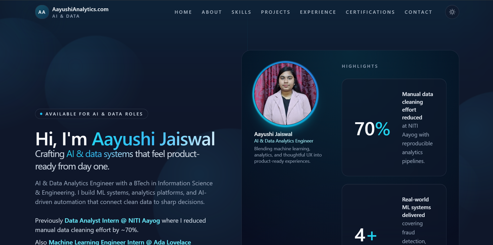
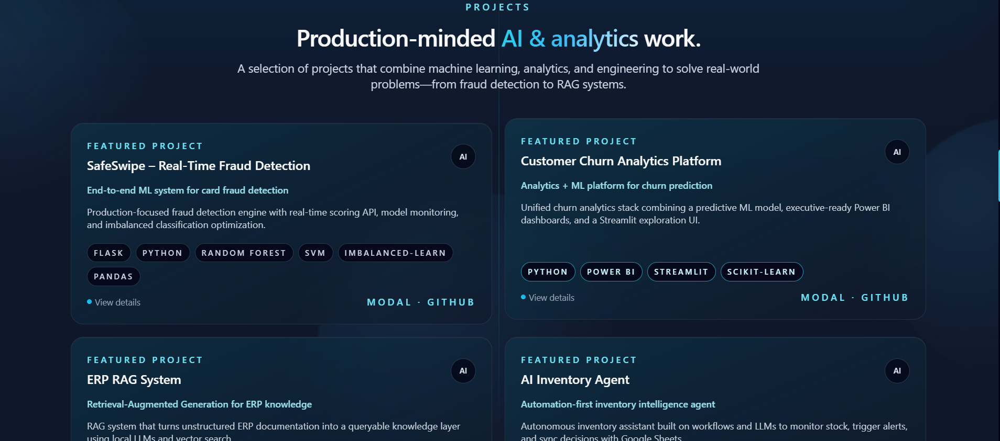
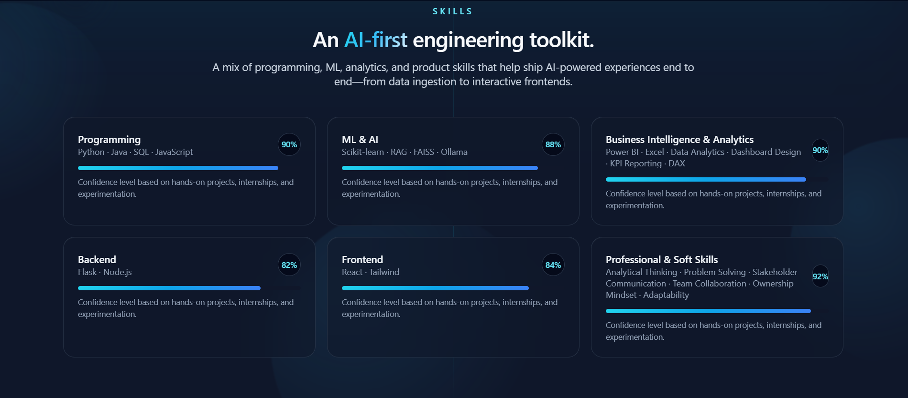

## AayushiAnalytics.com – AI & Data Portfolio

Production-ready personal portfolio for **Aayushi Jaiswal**, positioned as an **AI & Data Analytics Engineer**.

Built with **React (Vite)**, **Tailwind CSS**, **Framer Motion**, **React Router**, **React Icons**, and **EmailJS**, and designed for deployment on **Vercel**.

### Tech Stack

- **Frontend**: React (Vite)
- **Styling**: Tailwind CSS, custom glassmorphism, gradients
- **Animations**: Framer Motion (page transitions, scroll animations, loaders)
- **Routing**: React Router
- **Icons**: React Icons
- **Contact**: EmailJS integration
- **Deployment**: Vercel-ready (`.vercel.json`)

### Project Structure

- `public/`
- `src/`
  - `assets/`
  - `components/`
  - `pages/`
  - `data/`
  - `hooks/`
  - `utils/`
- `App.jsx`
- `main.jsx`
- `index.html`
- `tailwind.config.js`
- `vite.config.js`
- `.vercel.json`

## 🖼 Application Preview






### Getting Started

#### 1. Install dependencies

```bash
npm install
```

#### 2. Run the development server

```bash
npm run dev
```

The app will be available at the URL printed in your terminal (usually `http://localhost:5173`).

#### 3. Build for production

```bash
npm run build
```

This generates an optimized production build in the `dist` folder.

#### 4. Preview the production build (optional)

```bash
npm run preview
```

### EmailJS Setup

1. Create an account at [EmailJS](https://www.emailjs.com/).
2. Create an email service and a template.
3. In `src/utils/emailjsConfig.js`, replace the placeholders with your actual values:

```js
export const EMAILJS_SERVICE_ID = 'your_service_id';
export const EMAILJS_TEMPLATE_ID = 'your_template_id';
export const EMAILJS_PUBLIC_KEY = 'your_public_key';
```

4. Make sure your template expects `from_name`, `from_email`, and `message` fields.

### Vercel Deployment

1. Push this project to a GitHub repository.
2. Go to [Vercel](https://vercel.com/) and import your GitHub repo.
3. Vercel will auto-detect **Vite** and use:
   - **Build Command**: `npm run build`
   - **Output Directory**: `dist`
4. The included `.vercel.json` ensures SPA routing (all paths rewrite to `index.html`).

### Scripts

- `npm run dev` – Start the Vite dev server.
- `npm run build` – Build the production bundle.
- `npm run preview` – Preview the production build locally.
- `npm run lint` – Run ESLint on the `src` directory.

### Notes

- Default theme is **dark**, with a toggle for light mode.
- The layout is **fully responsive** (mobile-first).
- Animations are tuned to feel modern and premium while remaining performant.

